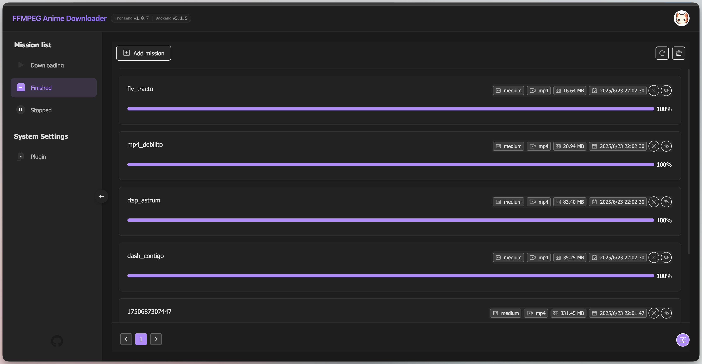

# <p align="center" style="display: flex;justify-content: center;"> FFandown</p>

<p align="center">ffandown是一个基于ffmpeg实现的m3u8视频下载器。</p>
<p align="center">ffandown is a m3u8 video downloader that is based on ffmpeg.</p>
<p align="center">
    <a href="https://hub.docker.com/r/h55205l/ffandown">
        
    </a>
    <a href="https://hub.docker.com/r/h55205l/ffandown">
        
    </a>
    <a href="https://github.com/helson-lin/ffandown">
          
    </a>
    <a href="https://github.com/helson-lin/ffandown">
        
    </a>
     <a href="https://github.com/helson-lin/ffandown">
        
    </a>
    <a href="/README.md">
        
    </a>
    <a href="https://qm.qq.com/q/7EtNRkt2eI">
        
    </a>
        <a href="https://t.me/ffandown">
        
    </a>
</p>


## User Guide
1. ✨ Currently supports downloading m3u8, rtsp, and rtmp live streams, as well as m3u8, mp4, and flv videos.
2. ✨ Supports download notifications (Bark, Feishu, DingTalk, Gotify).
3. ✨ Supports custom download transcoding formats (mp4, mov, flv, avi).
4. ✨ Supports custom request headers.
5. ✨ Full platform support.
6. ✨ Supports a plugin system (official version v5.0.0).
7. ✨ Supports proxy configuration.

## Project Setup
1. Install dependencies: `npm install`
2. Run the service: `npm run dev`


## Project Packaging

### PKG Packaging
Run `npm run pkg` in the terminal.

### Release Notes
The executable files for the release platform are pre-packaged for common platforms only. For other platforms or architectures, please use Docker or package them manually.

### Docker Installation
Shell command:

```shell
docker run -d -p 8081:8081 -v /home/media:/app/media -v /home/config:/app/config -v /home/logs:/app/logs h55205l/ffandown:latest
```

- `/app/media`: Directory for downloaded media. Default port is 8081.
- `/app/config`: Directory for configuration files.
- `/app/logs`: Directory for log files.
- `/app/lib`: FFmpeg、FFprobe Directory.
- `/app/public`: Directory for frontend static files.
- `/app/error-reports`: Error Report.

## Configuration File
```yml
port: 8381 # Server Port
downloadDir: /media/ # download directory
webhooks: https://nz.helson-lin.cn/message?token=A3HJgdetn8Rhh9g # webhook website
webhookType: gotify # webhook type: bark、gotify、FeiShu、DingDing
thread: true # Multithreaded transcoding
autoInstallFFmpeg: true # Auto Install FFmpeg
maxDownloadNum: 3 # Maximum simultaneous downloads
preset: medium # Transcoding preset
outputformat: mp4 # convert format
enableTimeSuffix: false # Enable timestamp suffix
secret: DJH1v3kXjV2v3oN4NHGlphZXyZGfmr3E # Authentication secret
proxy:  http://127.0.0.1:7897 # Proxy address
```


## Usage
After starting the service, you will see the message `server running on port: 8081`.
Open `localhost:8081` in your browser to access the download page.



### Plugin List (Supported in v5.1.3 or the latest version)
| Plugin Name | Plugin URL | Repository | Description |
|------------|------------|------------|------------|
| bilibili | [GitHub](https://github.com/helson-lin/ffandown-plugin/releases/download/v0.0.2/index.js) | [GitHub](https://github.com/helson-lin/ffandown-plugin) | Supports Bilibili live streams and video parsing. Without setting cookies, only 480p downloads are available. |


### API for Creating Download Tasks
[API Documentation](https://apifox.com/apidoc/shared-d00c4b27-4841-4ecd-932c-b04bdc3b94cd)
- Endpoint: `http://localhost:8081/down`
- Method: `POST`
- Header: `Content-Type: application/json`
- Parameters:
    ```js
    {
        name: "videoname",
        url: "http://playertest.longtailvideo.com/adaptive/bipbop/gear4/prog_index.m3u8",
        audioUrl: '', // Audio URL (used for merging audio and video files)
        outputformat: "mp4",
        preset: "medium",
        username: "", // login user name
        password: "", // login user password
        dir: "/videos", // Save directory
        headers: [
            {
                key: 'User-Agent',
                value: 'Mozilla/5.0 (Macintosh; Intel Mac OS X 10_15_7) AppleWebKit/537.36 (KHTML, like Gecko) Chrome/120.0.0.0 Safari/537.36'
            }
        ]
    }
    ```

### Configuring iOS Shortcuts
[Download Shortcut ✈️](https://www.icloud.com/shortcuts/d839d5fab95c48e0ab59e72396ec8280)
Before using, remember to edit the shortcut and update the server IP address and port.

## Disclaimer
All risks arising from the use of this project are borne by the user. We are not responsible for any direct, indirect, incidental, special, or consequential damages caused by the use of this project, including but not limited to loss of profits, data loss, or other economic losses.
*Limitation of Liability*: To the maximum extent permitted by applicable law, the authors and contributors of this project shall not be liable for any losses caused by the use or inability to use the project.

## License
This project is licensed under the AGPLv3 License. For details, please refer to the LICENSE file.

## Acknowledgments
- [FFmpeg](https://ffmpeg.org/)
- [node-fluent-ffmpeg](https://github.com/fluent-ffmpeg/node-fluent-ffmpeg)

## Donations and Support
Special thanks to **Gentle**, **Xinzai** for their donations and support, and to **jk9527** for their technical contributions.

## Star History
[](https://star-history.com/#helson-lin/ffandown&Date)
