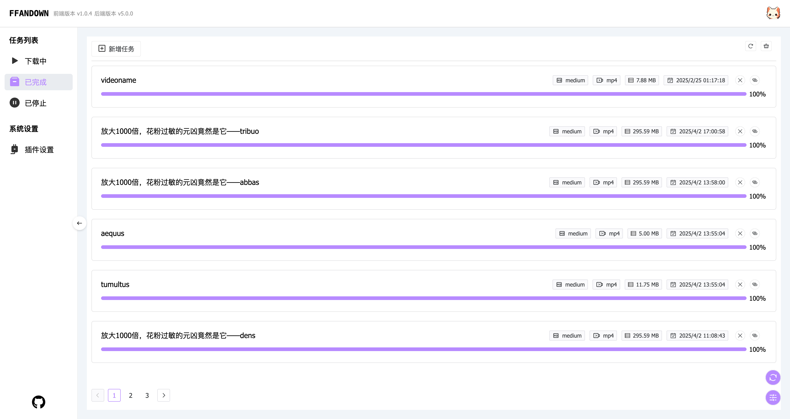

# <p align="center" style="display: flex;justify-content: center;"> FFandown</p>

<p align="center">ffandown是一个m3u8视频下载器，基于ffmpeg实现视频的下载。
<p align="center">ffandown is a m3u8 video downloader,that base on ffmpeg</p>
<p align="center">
    <a href="https://hub.docker.com/r/h55205l/ffandown">
        
    </a>
    <a href="https://hub.docker.com/r/h55205l/ffandown">
        
    </a>
    <a href="https://github.com/helson-lin/ffandown">
          
    </a>
    <a href="https://github.com/helson-lin/ffandown">
        
    </a>
     <a href="https://github.com/helson-lin/ffandown">
        
    </a>
    <a href="/README-en.md">
        
    </a>
     <a href="https://qm.qq.com/q/7EtNRkt2eI">
        
    </a>
        <a href="https://github.com/helson-lin/ffandown">
        
    </a>
</p>

## 使用说明

1. ✨ 目前支持 m3u8、rtsp、rtmp 直播下载和 m3u8、mp4、flv、视频下载
2. ✨ 支持下载消息通知（bark、飞书、钉钉、gotify）
3. ✨ 支持自定义下载转码格式（mp4、mov、flv、avi）
4. ✨ 支持自定义请求头
5. ✨ 全平台支持
6. ✨ 支持插件系统（v5.0.0 正式版本）
7. ✨ 支持代理配置
   

[详细使用文档地址和更新计划安排](https://ffandown.oimi.space/)

## 项目运行

1. 依赖安装：`npm install` 
2. 运行服务: `npm run dev`


## 项目打包

### PKG打包

终端运行 `npm run pkg`


### Release说明

release平台可执行文件，打包仅打包了常用平台，其他平台架构请使用docker或自行打包


### Docker安装

shell:  `docker run -d -p 8081:8081 -v /home/media:/app/media  -v /Uses/helson/config:/app/config -v /Uses/helson/logs:/app/logs h55205l/ffandown:v5.1.0-Beta`

`/app/media`为下载媒体的目录、默认8081端口

`/app/config`为配置文件目录

`/app/logs`为日志文件目录

`/app/public`为前端静态文件目录


## 使用

服务启动之后，可以看到`server runing on port: 8081`的字样
直接在浏览器打开`localhost:8081`就可以看到下载页面



### Api创建下载任务

[API 文档](https://apifox.com/apidoc/shared-d00c4b27-4841-4ecd-932c-b04bdc3b94cd)

- 接口地址：`http://localhost:8081/down`
- 请求方式：`post`
- 请求头： `Content-Type`: `application/json`
- 参数: 
    ```js
    {
        name: "videoname",
        url: "http://playertest.longtailvideo.com/adaptive/bipbop/gear4/prog_index.m3u8",
        audioUrl: '', // 音频地址（音频地址用于合并音视频文件）
        outputformat: "mp4",
        preset: "medium",
        dir: "/videos", // 保存目录
        headers: [
            {
                key: 'User-Agent',
                value: 'Mozilla/5.0 (Macintosh; Intel Mac OS X 10_15_7) AppleWebKit/537.36 (KHTML, like Gecko) Chrome/120.0.0.0 Safari/537.36'
            }
        ]
    }
    ```


### 配置ios快捷指令使用

[快捷指令下载地址✈️](https://www.icloud.com/shortcuts/d839d5fab95c48e0ab59e72396ec8280)

使用前记得先编辑指令，修改服务器的地址IP和端口

## 免责声明

使用本项目所产生的所有风险由用户自行承担。我们不对因使用本项目而导致的任何直接、间接、偶然、特殊或后果性的损害负责，包括但不限于利润损失、数据丢失或其他经济损失。 责任限制：在适用法律允许的最大范围内，项目作者及贡献者对因使用或无法使用本项目而导致的任何损失不承担责任。

## License

此项目采用创作共用署名-非商业性使用4.0国际公共许可证进行许可。详情请查阅LICENSE文件。

## 致谢

- [FFmpeg](https://ffmpeg.org/)
- [node-fluent-ffmpeg](https://github.com/fluent-ffmpeg/node-fluent-ffmpeg)
  

## 捐助和支持

感谢**Gentle**、**鑫仔** 捐助支持、感谢**jk9527**技术贡献、

## Star History

[](https://star-history.com/#helson-lin/ffandown&Date)
